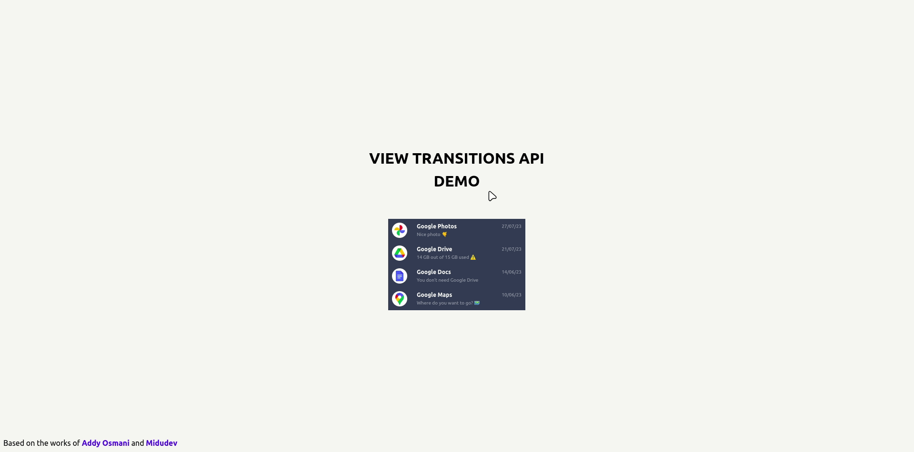

# View Transition API Demo

Simple demo about view transition API using:

- JavaScript
- [Astro](https://astro.build/) 
- [Tailwind](https://tailwindcss.com/)

## Usage ⌨️

```
# Install dependencies
$ npm install

# Starts local dev server at localhost:3000
$ npm run dev

# Build your production site to ./dist/
$ npm run build
```

## Example 👈🏻 

